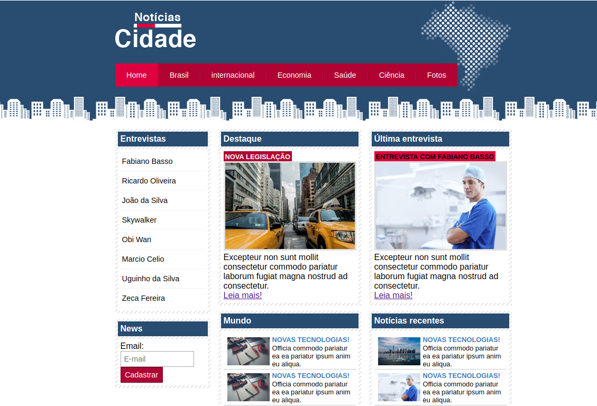
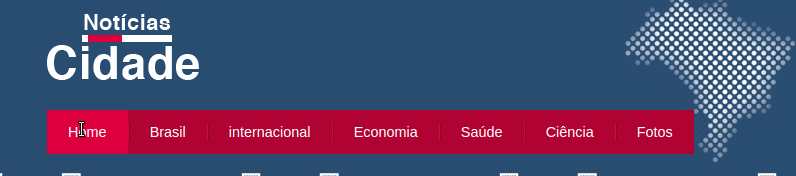
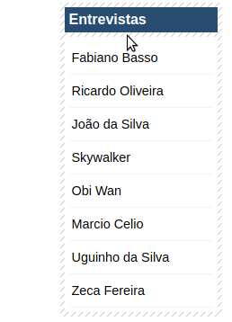

<h1> Project - Notícia Cidade </h1> 

Notícia Cidade - Um projeto pessoal para um portal de notícia, o portal é estático os objetos têm apenas animações porque aqui o objetivo foi mostrar as minha habilidades usando apenas HTML5 e CSS.

Toda estilização desse projeto foi feita usando somente CSS aplicando muita técnica avançada.

<strong>Todas as imagens do projeto são de domínio público, texto foram extraídos do lorem ipsum </strong> 

 
 
Demosntração do projeto:  
    
 
 
Menu do topo com efeito muito legal ao passar o mouse e ao clicar:  
  
 
 
Menu Lateral com efeito muito legal ao passar o mouse:  
  
 
 

Notícias Cidade - A personal project for a news portal, the portal is static the objects have only animations because here the objective was to show my skills using only HTML5 and CSS.

All stylization of this project was done using only CSS applying a lot of advanced technique.

<strong> All images of the project are public domain, text was extracted from lorem ipsum </strong>

 
 
Project Demonstration:

 
 
Top menu with very cool effect when hovering and clicking:
 

 
 
Side menu with very cool effect when hovering:
 

